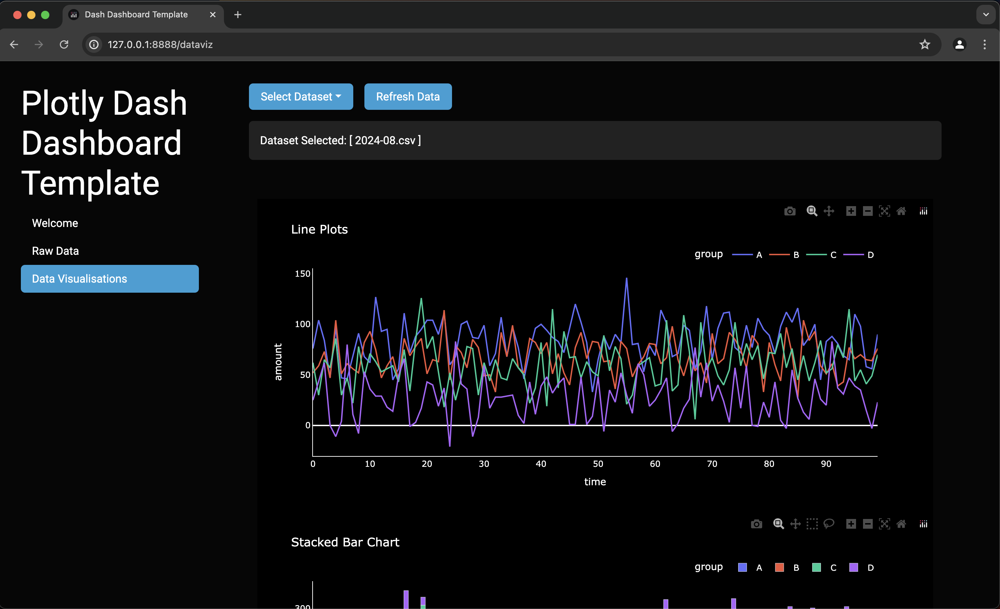
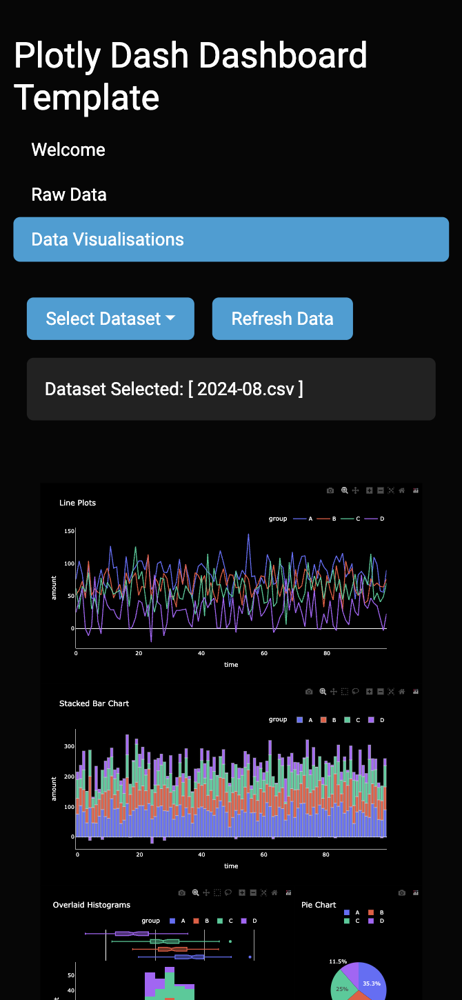

# Plotly Dash Data Dashboard Template

An example of a data dashboard built using Plotly Dash in python.

How it looks on a laptop (macbook air):



How it looks on a mobile phone (iPhone XR):



I apologise for the somewhat messy code (no modularisation etc.). I would enjoy cleaning up the codebase, but I want to go and learn new things more!

Simulate data to show in the dashboard:

```bash
$ python simulate_data.py \
    --n_datasets 10 \
    --n_groups 3 \
    --n_rows_per_group 100
```

Deploy locally:

```bash
python -m venv venv
source venv/bin/activate
pip install -r requirements.txt
python dash_app.py
# feature flags:
python dash_app.py --debug # shows diagnostic information on the dashboard (for dev)
python dash_app.py --expose_to_public_internet # make available over http from anywhere
```

Deploy on a Google Cloud Run service:

```bash
GCP_PROJ_ID="your_google_cloud_project_id_here"
GCP_REGION_NAME="region_in_which_to_deploy_service" # e.g. "africa-south1"
GCP_ARTIFACT_REG_REPO_NAME="your-artifact-registry-repo-name"
API_NAME="joes-example-dashboard"
source build_deploy_cloud_run.sh
```

Here is how dataset selection works:

1. On first starting a session, a user will have no datasets selected. The pages related to data will simply show a message informing the user to select a dataset.

2. Dataset data is cached within the user's session. When a user selects a dataset, that data will be fetched from their session cache (if it is there) or fetched from the database and stored in their session cache (if it is not there).

3. When the user clicks the "refresh data" button, the dashboard does the following:

   - Fetch updated list of available datasets from the database

   - Delete all existing datasets in cache

   - Change the "selected dataset" back to nothing selected

Known issues not yet fixed:

- The code needs a clean and refactor (very messy)

- Plots on small screens are being cropped on Firefox browser (this is to do with the Firefox implementation of the `zoom` CSS property)

- The dashboard does not look good yet on very large screens (there is wasted space)
